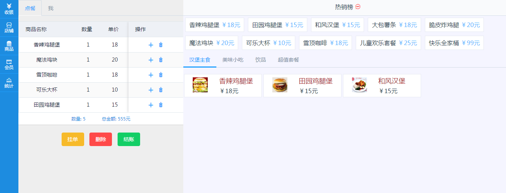
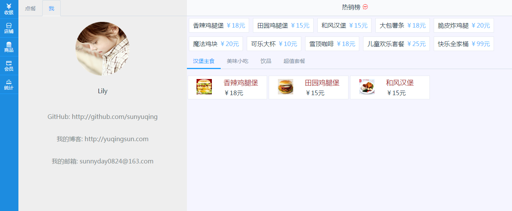

## 基于Vue的快餐店点餐系统

### 技术栈：

    *vue + vuex + vue-router + axios + element-ui + webpack + stylus + es6*

### 技能栈

    1.flex布局： 左边固定宽度，右侧自适应布局方式；
    2.解决Element组件高度无法100%的问题： 使用原生js方法实现

### 项目截图




### 在线demo

[基于vue的快餐点餐系统](http://sunyuqing.coding.me/pos-sys)

## 运行项目

# install dependencies
npm install

# serve with hot reload at localhost:8080
npm run dev

# build for production with minification
npm run build

# build for production and view the bundle analyzer report
npm run build --report
```
